# 📈 Zerodha Clone – Frontend Web Application

---

## 🧾 Project Overview

**Zerodha Clone** is a frontend-focused web application that replicates the core user interface and layout of the Zerodha trading platform.  
The project focuses on **clean UI design, responsiveness, and real-world dashboard structuring**, following modern frontend development practices.

---

## ✨ Key Features

- Built a **responsive trading platform UI** using **HTML5, CSS3, and JavaScript**
- Designed **semantic and well-structured HTML layouts** for better accessibility and SEO
- Implemented **modern landing pages and dashboard-style components**
- Created **reusable UI components** such as navigation bars, cards, tables, and buttons
- Developed a **clean and intuitive navigation flow** similar to real fintech platforms
- Followed a **mobile-first approach** to ensure responsiveness across all devices
- Optimized layout and assets for **fast load time and smooth user experience**
- Maintained clean, readable, and **industry-standard frontend code**

---

## 🛠️ Tech Stack

- **HTML5**
- **CSS3**
- **JavaScript**
- **Responsive Web Design**
- **Git & GitHub**

---

## 🎯 Learning Outcomes

- Gained hands-on experience in **building large-scale frontend layouts**
- Improved understanding of **fintech-style dashboard UI design**
- Strengthened skills in **responsive design and layout management**
- Learned how professional trading platforms structure and organize UI components
- Practiced writing clean, maintainable, and scalable frontend code

---

## 📸 Screenshots
1.hero
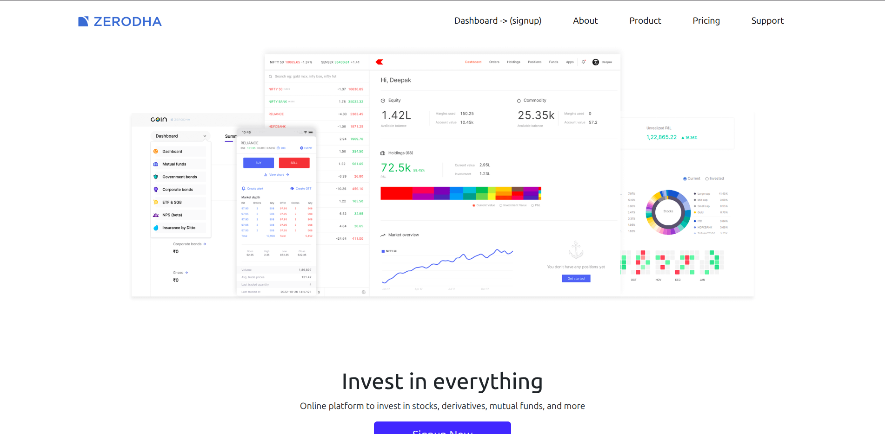
2.Home1
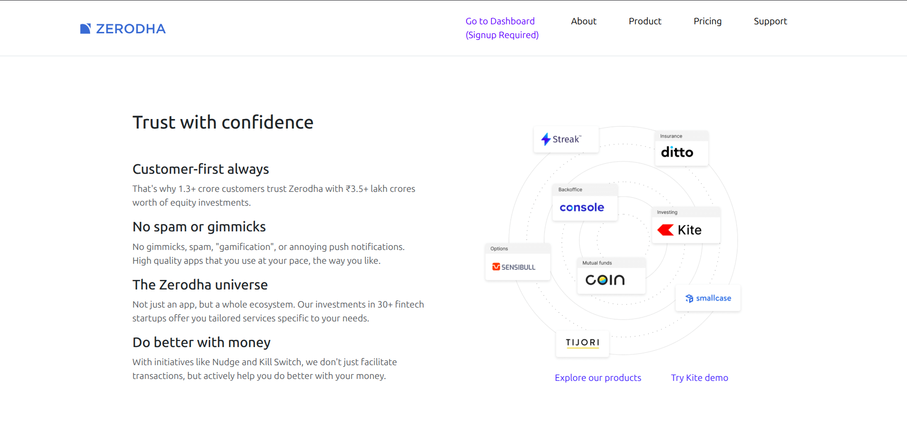
3.Home2
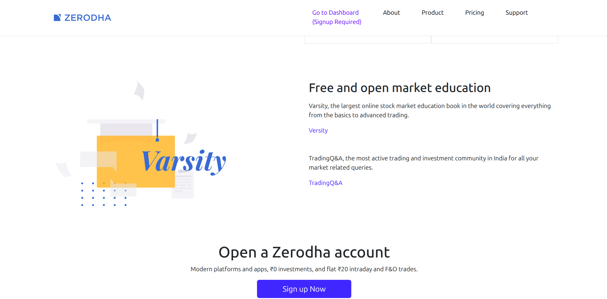
4.About

5.Product

6.Pricing
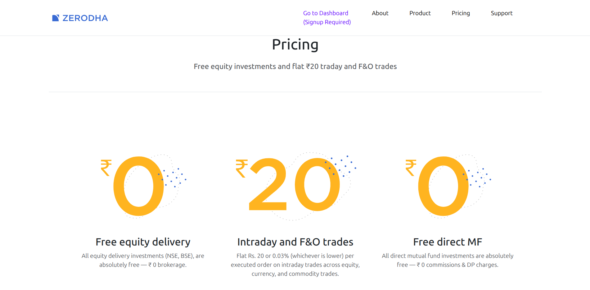
7.Support
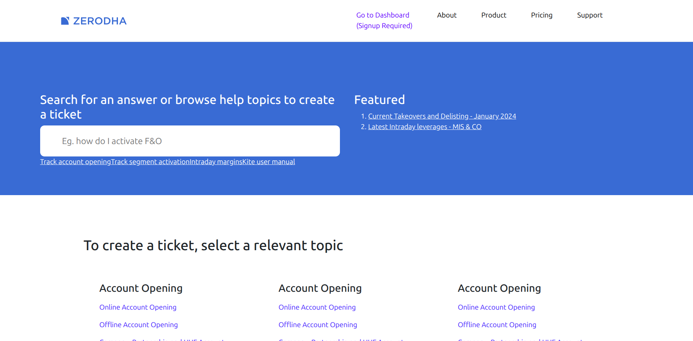
8.signup
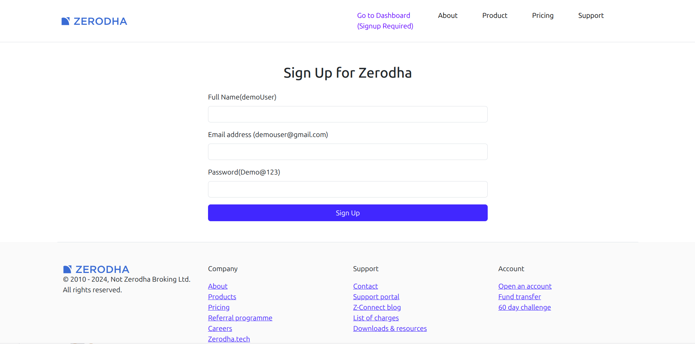
9.Dashboard
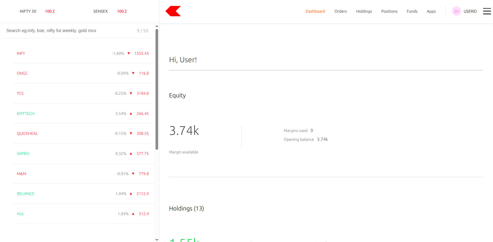
10.Charts
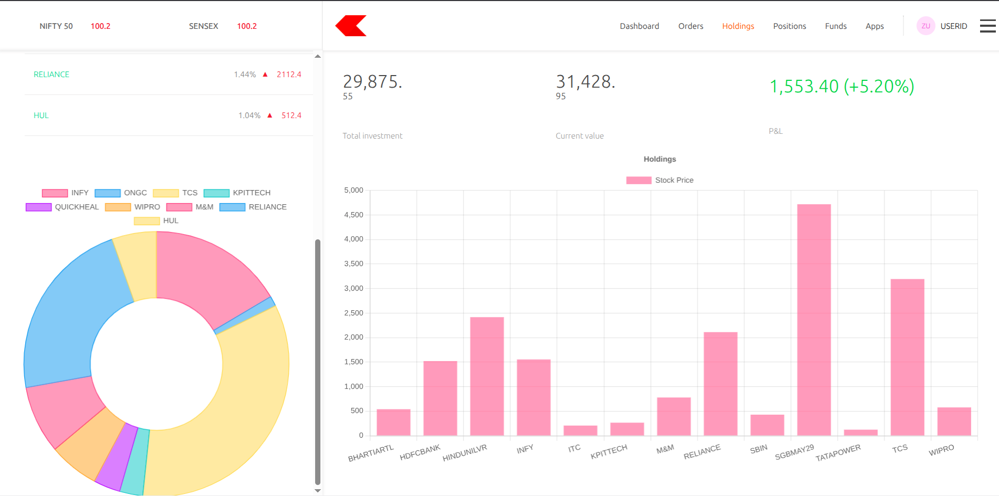
11.Holdings
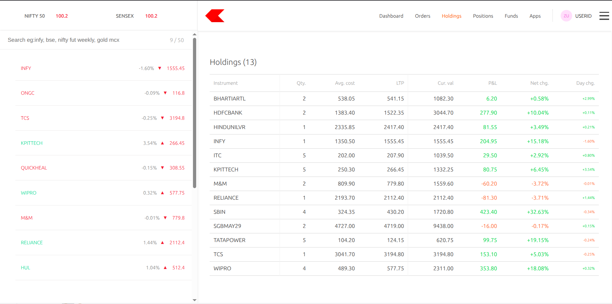
12.Positions
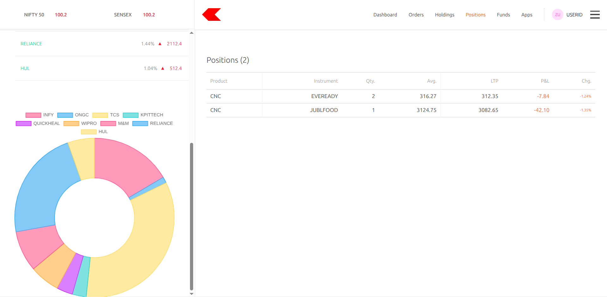
13.funds
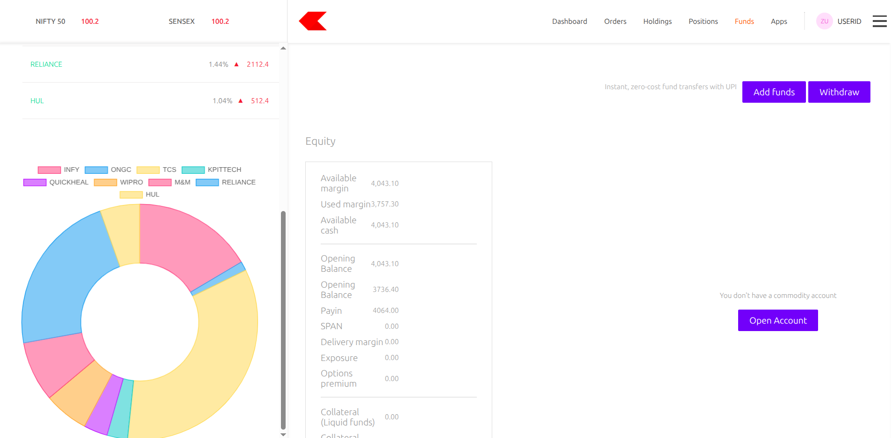
14.apps
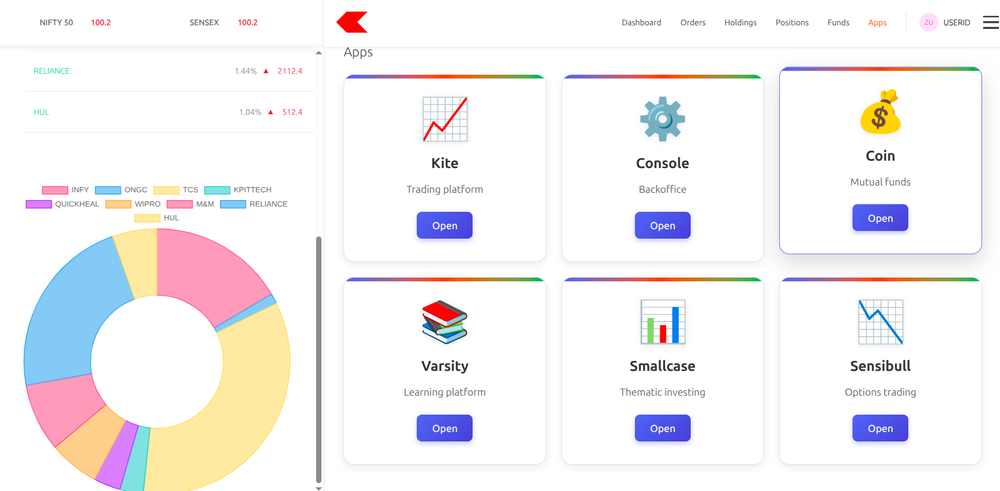
15.Footer
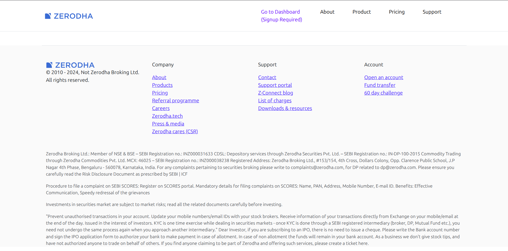
---

## 🚀 Future Enhancements

- Add backend integration for user authentication
- Implement real-time stock data using APIs
- Add charts and analytics dashboards
- Improve accessibility using ARIA roles
- Enhance performance and UI animations

---

## ⚠️ Disclaimer

This project is created **for educational purposes only**.  
It is **not affiliated with or endorsed by Zerodha**.

---

## 👤 Author

**Mayank Tyagi**  
Frontend Developer | Web Development Enthusiast

---

## ⭐ If you like this project

Give it a ⭐ on GitHub — it motivates me to build more!
